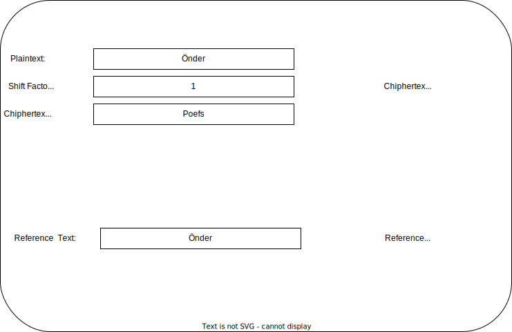

# 1. Week - 3 March 2023 Friday


14:15 te derslerimiz başlıyor olacak.

[Dr. Öğr. Üyesi Hamza Osman İLHAN](https://avesis.yildiz.edu.tr/hoilhan/publications) hocamız ile işliyoruz.

10-12 yıldır akademide. Öncesinde özel sektörde çalışıyordu.

Kitap Önerisi;  
Understanding Cryptography  
A textbook for Students and Practitioners

Vize olacak 29 Nisan  
21 Nisan tatil  
19 Mayıs tatil  

# Değerlendirme

**Ara Sınav %20:** (DES, AES genel olarak olur.)  
**Ödev %10:** (Son teslim tarihi = 31 Mart 2023) İlk 2 haftanın konularını kapsayacak.  
**Proje %30:** ağırlığında olacak. DES, AES ve RSA yi karıştırarak oluşturulan bir program (kütüphane kullanmadan) yapılacak. Proje grup olarak yapılabilir.  
* Akan şifreleme olursa 50 puan  
* DES veya AES mimarisi içirisinde güncellemeler 75 puan  
* RSA mimarisi veya asimetrik şifreleme mantığı ile oluşturduğunuz algoritma 125 puan üzerinden değerlendirilecek. RSA in implementasyonunda DES kullanarak şifreleme yapılıyor olabilir.  

**Final %40** etkili

# Classification of the Field of Cryptography

Cryptography
* Symmetric Ciphers
  * Block Ciphers
  * Stream Ciphers
* Assymetric Ciphers
* Protocols


Kriptografi  
* Kriptoanaliz: Kripto sistemleri çözme ve kırma sanatı.
* Simetrik Algoritmalar: Anahtarda mutabık kalınması ve herkesin bilmesi gerekiyor. Asimetrik Algoritmalar: Public key ve private key
* Protokoller: Simetrik ve asimetrik algoritmaların birbiri ile kullanılması. Mesela ssh protokolü

# Symmetric Cryptography

Alice (sender) --> Bob (receiver)  
Oscar spy  
Simetrik te karşı tarafa güvenli bir şekilde key in iletilmesi gerekiyor.

* x: Plaintext - Cleartext - Düz Metin  
* y: Chiphertext - Şifreli Metin  
* K: Key - Anahtar  
* e: encrypt - şifrele  
* d: decrypt - şifreyi çöz  

$$ y = e_K(x) $$
$$ x = d_K(y) $$

Inverse operation is possible;  
$$ x = d_K(e_K(x)) $$

Key Space - Anahtar Uzayı {K1, K2, ..., Kn}

Oscar ortaya girerse karşı tarafa giden mesajı değiştirip anlamsızlaştırabilir? (Alice imzalayarak gönderirse (RSA ile) sorun çözülür)  
Oscar ortaya girerse bazı mesajları tekrarlayarak istediği bazı işlemleri Alice miş gibi yaptırabilir.

Problems in symetric cryptography;
* Confidentiality: Bu örnekte sadece verinin gizliliği
* Message integrity: Oscar'ın mesajda değişiklik yapması durumu
* Sender authentication: Mesajın gerçekten Alice'den geldiğine emin olamama

# Cryptanalysis?

A cryptosystem should be secure even if the attacker (Oscar) knows all details about the system, with the exception of the secret key.

Only use widely known ciphers that have been cyptanalyzed for several years by good cryptographers!


* Classical
  * Mathematical Analysis
  * Brute-Force Attacks
* Implementation Attacks
* Social Engineering

# Brute-Force Attack

128 bit Long-term (several decades in the absence of quantum computers)
256 bit Long-term (also resistant against quantum)

Şu an çok güçlü olan bir yöntemin 15 sene sonra yine kullanımının devam edebileceği, kırılamayacağını söylemek doğru olmaz (Moore's Law).

# Substitution Cipher - Yerine Koyma - Yer Değiştirme

Idea: Replace each plaintext letter by a fixed other letter.

Plaintext  CipherText

A --> k  
B --> d

ABBA would be kddk

Kripto analiz ile;
* Metadatayı okuyunca çok kolay çözülebilir.
* Uzunluk
* CRC
* İngilizce için sık kullanılan harf a ise mesela k = e diyebilir. (harf sıklık analizi)  
gibi temel bilgiler başta bulunabilir.

# Ödev 1
Arayüz üzerinden girilen sade metnin, kullanıcı tarafından tanımlanacak yer değiştirme anahtarı ile şifrelemesi gerçekleştirilecek (40 Puan)  
* Metin girebileceği bir textbox oluşturulacak. Bu girilen metin Öteleme sayısı kadar ileriye atılacak.

* K: Öteleme sayısı. 5 girdiğinde a yı 5 tane öteleyecek bcçde yani e olacak
* Eğer alfabenin sonundaki harflere denk geliyorsa başa dönsün

Şifrelenmiş metin üzerinde harf sıklık analizi gerçekleştirilecek ve arayüz üzerinde grafiksel olarak şifreli metine ait harf sıklık analizi raporlanabilecek (20 puan)
* Bar chart ile harflerin sıklıkları gösterilecek şifreli metin için.

Harf sıklık analizi tabanlı şifre çözme işlemi için arayüz üzerinden referans alınacak metin girilebilecek ve girilen referans metinin harf sıklık analizi gerçekleştirilip, arayüz üzerinde görselleştirilecek (20 puan)
* Şifrelenmemiş referans metnin girilebileceği bir alanda bulunacak. Burada bulunan değerleri referans alarak şifrelenen metnin ne olduğu tahminlenecek
* Referans metin içinde bir bar chart oluşturulacak. (sıklık analizi) Değerlendirmede bu kullanılacak.

Şifreli metni çözme işlemi gerçekleştirilecek. Sade metin ile çözülmüş metin harf olarak karşılaştırılarak doğruluk noktasında performans ölçülecek (20 Puan)

```
Örnek Ölçme = Ali ve Veli top oynuyor (Sade Metin)  
              eli ila vali pst synuysr (Çözülmüş Metin)
```

* Çözme Performansı = 20 Harf üzerinden 8 hata = %60 doğru çözümleme
* Harf sıklık analizlerinde elde edilen veriler ile şifrenin çözülmesi sağlanacak.

Bonus = ile, ve, mi, mu, ? ... gibi bazı özel belirteçlerin çözümlemede ayrı değerlendirilmesini sağlayacak algoritma tasarımı (ekstra 20 puan - fazla puanlama proje puanına eklenir)

* Excel de yapmayın. Bir programlama dili kullanarak yapın. Exe şeklinde olabilir. Bir zip veya rar haline getirerek yüklerseniz iyi olur. Deployment web olursa olur mu? Ücretsiz sitelerden yapılabilir.
* sokak numarası (32. sokak) gibi kısımlar bonusa girer.

# Çözüm
* Kısıtlar:
Türkçe desteği için kendi belirlediğim bir dizi içerisinde sonraki harfin ne olacağı bilgisini tutuyorum.

Her harfin karşılık geldiği harf dizi olarak tutulacak ve bu dizideki değerlere göre yerdeğiştirme uygulanacak.


