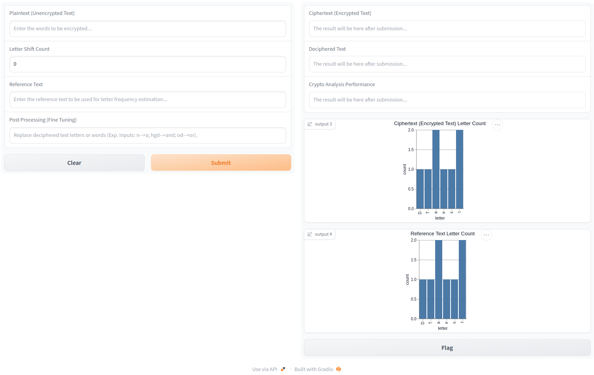
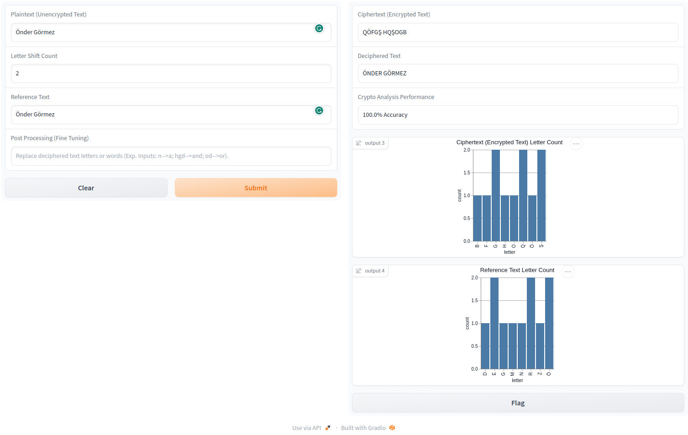
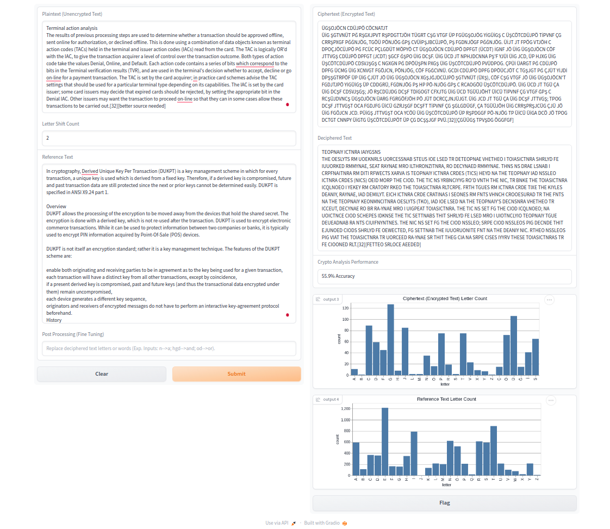
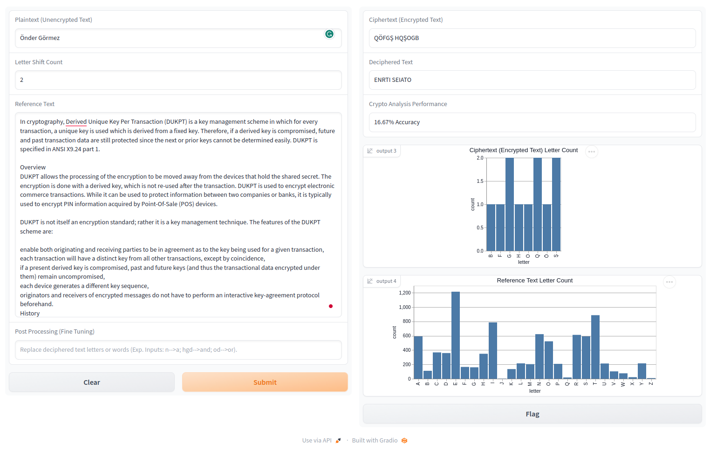
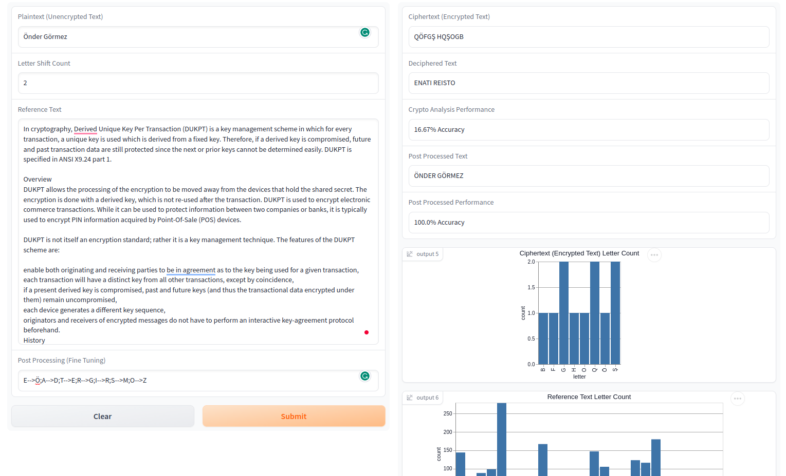

# Ödev Raporu

## Ad Soyad: Önder Görmez  
## Öğrenci No: 21501035

# Requirements

```sh
onder@Dell:~/.../...Crypto...$ sudo apt install python3
onder@Dell:~/.../...Crypto...$ pip3 install gradio
onder@Dell:~/.../...Crypto...$ pip3 install notebook
```

# Formulation

* x: Plaintext - Cleartext - Düz Metin  
* y: Chiphertext - Şifreli Metin  
* K: Key - Anahtar  
* e: Encrypt - Şifrele  
* d: Decrypt - Şifreyi çöz  

$$ y = e_K(x) $$
$$ x = d_K(y) $$

Inverse operation is possible;
$$ x = d_K(e_K(x)) $$

# Graphical User Interface (GUI)

GUI üzerinde **solda** bulunan kısımlar **girdileri**, **sağda** bulunan kısımlar ise **çıktıları** temsil etmektedir.

### Inputs

* **Plaintext (Unencrypted Text)**: Şifrelenecek metinin girileceği bölümü temsil etmektedir.
* **Letter Shift Count**: Kaydırma işleminin ne kadar yapılacağını göstermektedir. Örn: değeri 2 ise; "**A**" harfi için "**C**" ciphertext değeri elde edilir.
* **Reference Text**: Buraya kullanılan dilin (Türkçe veya İngilizce) cümle içerisinde genel harf kullanım pattern ini tespit etmek için olabildiğince uzun bir yazı girilmelidir. Bu yazı ile ciphertext decrypt edilecektir.
* **Post Processing (Fine Tuning)**: "Deciphered Text" alanında elde edilen şifresi çözülmüş metinde bulunan patternlerde tespit edilen hataların düzeltilmesi için kullanılacaktır.
  * Örn: "ule" yerine "ile" yazılmak istenirse ule-->ile şeklinde girilmelidir.
  * Sadece 1 harf değişitirilmesi de mümkündür.
  * Birden fazla değer girilmek istenirse ";" ile ayrılabilir.
* **Clear**: Input lara girilen değerlerin silinmesini sağlar.
* **Submit**: Şifreleme işlemini başlatır.

### Outputs

* **Ciphertext (Encrypted Text)**: Her harfi kaydırma sayısı kadar ötelenmiş şifreli metindir.
  * Öteleme sonucunda elde edilen harf alfabede bulunan son harften daha sonraya ulaşırsa, alfabenin başından devam eder.
  * Örn: Kaydırma sayısı "**2**" ve Plaintext "**Y**" ise şifrelenmiş harf "**A**" olur.
* **Deciphered Text**: Harf sıklık analizi sonucu karşılaştırılarak elde edilen şifresi çözülmüş metindir.
  * Metin ile plaintext metin gözle karşılaştırıldığında yanlış deşifre edilmiş karakterler bulunabilir.
* **Crypto Analysis Performance**: Plaintext metin ile deciphered text metin arasındaki benzerliğin oranı olarak tanımlanabilir.
* **Ciphertext (Encrypted Text) Letter Count**: Şifreli metin özelinde yapılan harf sıklık analizinin arayüzde grafiksel olarak gösterilmesi için kullanılır.
  * Başlangıçta "**Test Data**" harf sıklık analizi ile doldurulmuştur.
  * Submit sonrası gerçek değerler ile doldurulacaktır.
* **Reference Text Letter Count**: Dil özelinde yapılan harf sıklık analizinin arayüzde grafiksel olarak gösterilmesi için kullanılır.
  * Başlangıçta "**Test Data**" harf sıklık analizi ile doldurulmuştur.
  * Submit sonrası gerçek değerler ile doldurulacaktır.



# Demos

## Best Case

* Referance text in plain text ile aynı olduğu durumdur.
* Harf sıklık analizi sonucu eşleştirme bire bir yapılacağından accuracy %100 çıkmaktadır.



## Average Case

* Reference text ve plain text in olabildiğince büyük verildiği durumdur.
* Bu durumda harf sıklık analizi dile göre yapılacağı için accuracy değeri yüksek çıkabilir.



Düz Metin Kaynak: [EMV](https://en.wikipedia.org/wiki/EMV)  
Referans Metin Kaynak: [DUKPT: Derived unique key per transaction](https://en.wikipedia.org/wiki/Derived_unique_key_per_transaction)

## Worst Case

* Plain text in çok küçük bir örneklem olduğu durum olabilir.
* Reference text in çok küçük bir örneklem olduğu durum olabilir.



Referans Metin Kaynak: [DUKPT: Derived unique key per transaction](https://en.wikipedia.org/wiki/Derived_unique_key_per_transaction)

# Conclusion

* Sonucun gerçeğe yakın çıkması kullanılan dil için (İngilizce veya Türkçe) olabildiğince büyük bir reference text ve plain text verilmesine bağlıdır Böylelikle dile ait harf kullanım sıklığı gerçek değere yakın değerlerde olabilmektedir.
* Ortalama durumda görüldüğü üzere post processing yapılmadan %50 civarında accuracy ortaya çıkmakta ve decipher işlem sonucu anlaşılamamaktadır. Bu nedenle **post processing/fine tuning** yapılması gerekmetedir. Aşağıda worst case senaryosunun post processing işlemine tabi tutulmuş bir örneği verilmiştir.



Referans Metin Kaynak: [DUKPT: Derived unique key per transaction](https://en.wikipedia.org/wiki/Derived_unique_key_per_transaction)

# Constraints

* Yalnızca ingilizce ve türkçe karakter setini şifreleyebilmektedir.
  * letters = 'ABCÇDEFGĞHIİJKLMNOÖPQRSŞTUÜVWXYZ'
* Harf olmayan girdiler (white spaces, numbers) direkt olduğu gibi şifreli metine aktarılıyor.
  * Accuracy hesabına da olduğu gibi dahil ediliyorlar. Bu nedenle tüm harfler yanlış deşifre edilse de accuracy %0 dan yüksek çıkabilir.
* Kod içerisinde girilen metinler büyük harfe çevrilerek hesaplamalar ve kripto analiz yapılıyor.
* Tüm hatalı input durumları kontrol edilmemiştir. Yanlış input durumunda program crash olabilir.

# Feature Works

* Bir docker imajı içerisine deploy edilabilir ve oradan bir port açarak erişimi sağlanabilirdi.
* Bir docker-compose.yml dosyası oluşturularak sadece **docker-compose up** ile çalıştırılabilir ve local ortamda bir şey kurmak zorunda kalınmayabilirdi.
* [Google Colab](https://colab.research.google.com/) veya [Hugging Face](https://huggingface.co/gradio) gibi bir ortama deploy edilerek kolay bir şekilde gözlemlenmesi sağlanabilirdi.
