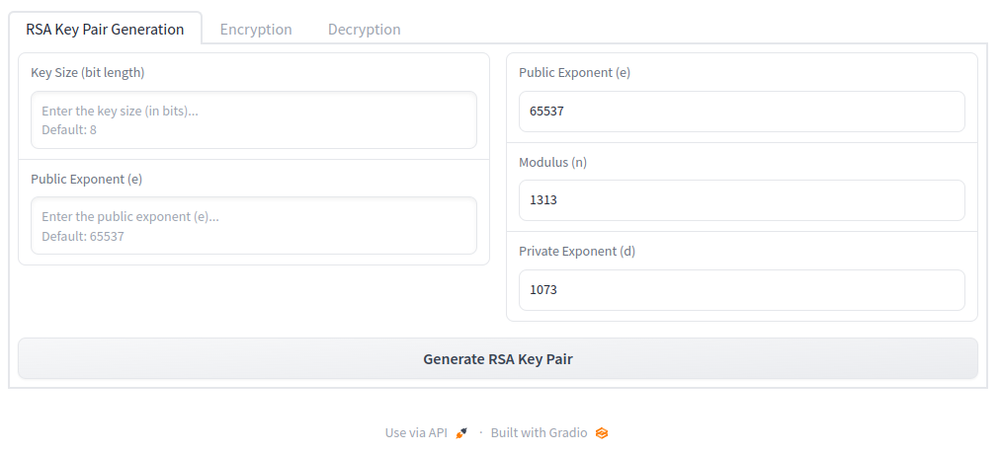
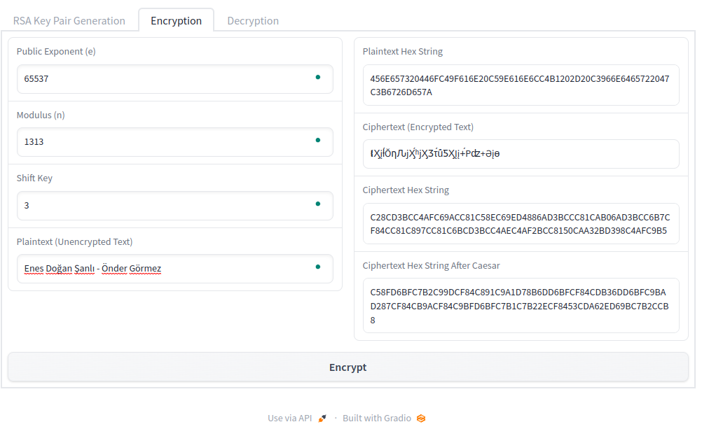
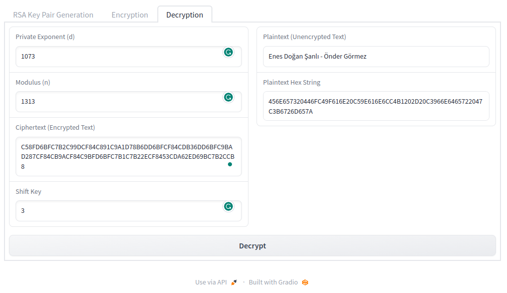
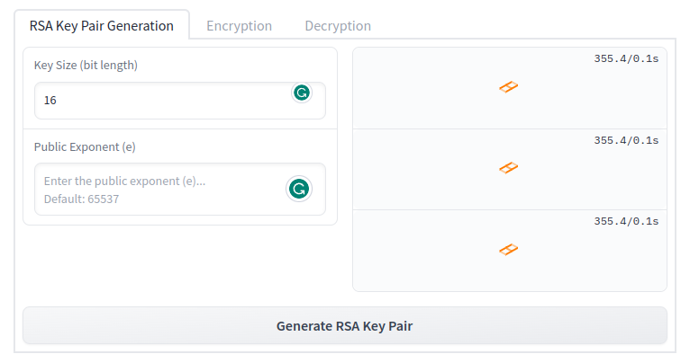
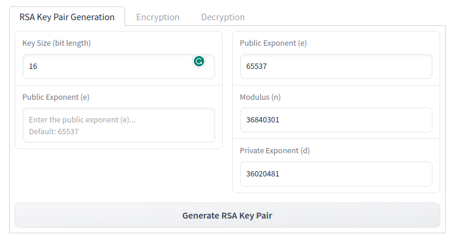

# Proje Raporu

|Ad-Soyad|Öğrenci Numarası|
|-------------|------------|
|Önder GÖRMEZ | 21501035  |
|Enes Doğan ŞANLI | 21501081 |

# Requirements

```
pip install -r requirements.txt
```

# Variables

| Variables | Explanation |
|-----------|-------------|
| Key Size (bit length) | Anahtar boyutu |
| Public Exponent (e) | Herkes ile paylaşılan genel anahtar |
| Modulus (n) | Herkes ile paylaşılan mod değeri | 
| Private Exponent (d)| Public Exponent ile elde edilen gizli anahtar | 
| Plaintext (Unencrypted Text) | Şifrelenmemiş metin |
| Ciphertext (Encrypted Text) | Şifrelenmiş metin |
| Ciphertext Hex String | Şifrelenmiş metnin hexadecimal formu | 
| Plaintext Hex String | Şifrelenmemiş metnin hexadecimal formu |

# RSA Algorithm

1. Choose two large primes (p,q)
2. Compute n = p * q
3. Compute phi = (p-1) * (q-1)
4. Select the public exponent e {1,2,...,(phi-1)} such that gcd (e, phi) = 1
5. Compute the private key d such that d * e = 1 mod(phi)
6. Return kpub = (n,e), kpr = d

# Caesar Algorithm

1. RSA in çıkışı olan encrypted text yeniden caesar algoritmasına sokulur.

# Graphical User Interface (GUI)

GUI yapısal olarak 3 ana bölümden oluşmaktadır. Bu bölümler RSA Key Pair Generation, Encryption ve Decryption olarak adlandırılmıştır. 

## RSA Key Pair Generation
RSA Key Pair Generation olarak adlandırılan alanda kullanıcıdan Key Size değeri ve Public Exponent değerlerini girmesi istenir. Bu bölümde Public Exponent, Modulus ve Private Exponent değerleri çıktılar olarak kullanıcıya döndürülür.

### Inputs

* Key Size (bit length) (default: 8)
* Public Exponent (e)

### Outputs

*  Public Exponent (e) (default: 65537)
*  Modulus (n)
*  Private Exponent (d)




## Encryption
Bu bölümde sisteme girdi olarak Private Exponent, Modulus ve Plain Text verilerek girilen metnin şifreleme işlemi gerçekleştirilir. Bu işlem sonucunda elde edilen Plaintext Hex String, Ciphertext (Encrypted Text) ve Ciphertext Hex String çıktı olarak kullanıcıya döndürülür.

### Inputs

* Public Exponent (e) (default: 65537)
* Modulus (n)
* Shift Key
* Plaintext (Unencrypted Text)

### Outputs

* Plaintext (Unencrypted Text)
* Ciphertext (Encrypted Text)
* Ciphertext Hex String
* Ciphertext Hex String After Caesar




## Decryption

Bu bölümde Public Exponent ile şifrelenmiş olan metnin Private Exponent ve Modulus değişkenleri kullanılarak çözümleme işlemi gerçekleştirilir.

### Inputs

* Private Exponent (d)
* Modulus (n)
* Ciphertext Hex String After Caesar (Encrypted Text)
* Shift Key

### Outputs

* Plaintext (Unencrypted Text)
* Plaintext Hex String



*NOT : Public Exponent'in default değer olarak 65537 seçilmesi zorunlu değildir. Daha düşük değerlerde de teorik olarak benzer güvenliği sağlayacağı ifade edilmiştir. Lakin 65537 gelecekte keşfedilebilecek zayıflıklara karşı savunmada daha etkili olacağından dolayı genel kabul görmüş bir değerdir. (https://www.daemonology.net/blog/2009-06-11-cryptographic-right-answers.html)*  
*NOT: Public Exponent değerinin prime number olması kontrolü gui üzerinde yapılmıştır.*

# Flow Chart - Crypto App

## RSA Key Pair Generation


## Encryption


## Decryption


# Performans İyileştirmeleri

## Public Exponent Seçimi

İlk tasarımda public exponent random ve otomatik olarak oluşturuluyordu. Fakat bu şekilde olduğunda generation işleminde ciddi bir zaman kaybı yaşanıyordu. Bu yüzden public exponent sabit olarak seçildi.

### 1. Yöntem
Aşağıdaki kod sonucu oluşturulmuş Public Exponent (e): 2854884083 değerinde iken;
* 6 dakikadan uzun bir süre beklememize rağmen sonuç alamadık.

```Python
    def generate_key_pair(bit_length):
        # Other codes
        public_exponent = RSA_GS.generate_public_exponent(phi)
```




### 2. Yöntem
Public exponent (e) değeri 65537 olarak sabitlendiğinde ise;

```Python
    def generate_key_pair(bit_length):

        public_exponent = 65537  # RSA_GS.generate_public_exponent(phi)
```



120 saniye civarında bir sürede sonuç alındı.


# Constraints

* Key size değeri çok yüksek olduğu zaman key pair generation işlemi çok uzun sürebiliyordu. Demo kullanımında bunun önüne geçmek için 8 ile 12 arasında değerler alacak şekilde sınırlandırdık.
* Hatalı input kontrolleri ile kullanıcının arayüzden yanlış değerler girmesini engelledik. 
  * Örneğin public exponent değerinin prime number olması gibi
  * Sayısal değerlerin girilebilmesi gibi

# Conclusion

* RSA ve Caesar algoritmasını kullanarak bir şifreleme uygulaması geliştirdik.
* Bu algoritmaların çalışma mantığını daha iyi anladık.
* Key pair generation işleminde public exponent değerini prime number olarak seçerek performans iyileştirmesi yaptık.

# Future Work
* Key size değerini daha esnek hale getirerek kullanıcıya daha fazla seçenek sunabiliriz.
* Caesar algoritmasının birlikte kullanılması opsiyonel olarak sunulabilir.
* Gerçek RSA algoritmasında olan gibi padding yöntemlerine çalışılabilir.

# References

* https://www.daemonology.net/blog/2009-06-11-cryptographic-right-answers.html
* https://en.wikipedia.org/wiki/RSA_(cryptosystem)
* https://d2908q01vomqb2.cloudfront.net/22d200f8670dbdb3e253a90eee5098477c95c23d/2022/05/24/image1-2.png


